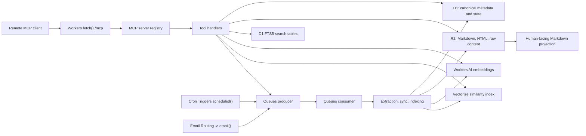

# KeepRoot MCP Server Technical Architecture

## Summary
KeepRoot should be implemented as a Cloudflare-native remote MCP server that treats the system as a personal knowledge substrate with three technical layers:
1. Canonical records
2. Retrieval interfaces
3. Agent actions

The human-facing Markdown layer sits on top of those three layers. It is important for inspectability and editing, but it should not replace the structured canonical store used at runtime.

The architecture should stay inside the existing `backend/` Worker project unless there is a later operational reason to split components. That gives one deployable system with four Worker entrypoints:
- `fetch`
- `scheduled`
- `queue`
- `email`

## Architectural Stance
- File format is secondary. Agent behaviors come first.
- Structured state is the centre of the system.
- Markdown is a projection and authoring layer.
- Retrieval is hybrid: metadata filters plus full-text plus vector search.
- Agent capabilities should be exposed as explicit tools, not raw table operations.
- Provenance, authorship, and reading state matter as much as raw text.

## Why This Architecture
This architecture is designed for the questions and actions agents actually need to perform:
- fetch the right document or item
- understand what the user has already saved, read, or processed
- distinguish between similar items by source, recency, or importance
- update notes or state safely
- maintain the reading queue and source subscriptions

That means the central design problem is not “Should this be Markdown or RAG?” The central design problem is “What exact records, retrieval paths, and tool actions must exist so the agent can behave reliably?”

## Layered Architecture

### 1. Canonical records
This layer is the durable source of truth.

Responsibilities:
- stable item identities
- structured metadata
- reading and triage state
- source subscriptions
- provenance
- durable content storage

Primary Cloudflare products:
- D1 for canonical metadata and state
- R2 for full text, Markdown payloads, raw HTML, and optionally email source payloads

### 2. Retrieval interfaces
This layer decides how agents discover relevant context.

Responsibilities:
- exact metadata filtering
- keyword search
- semantic similarity search
- relationship-aware retrieval later

Primary Cloudflare products:
- D1 queries for structured filters
- D1 FTS5 for full-text search
- Workers AI for embeddings
- Vectorize for nearest-neighbour search

### 3. Agent actions
This layer defines what the agent is allowed to do.

Responsibilities:
- save URLs
- fetch and update records
- add and remove sources
- manage inbox state
- inspect account and usage

Primary Cloudflare products:
- Workers runtime for the MCP endpoint
- Queues for asynchronous work
- Cron Triggers for periodic source sync
- Email Routing and Email Workers for inbound email ingestion

### Human-facing Markdown projection
This is not the runtime centre, but it is an important product layer.

Responsibilities:
- transparency
- portability
- human editing and inspection
- optional future Obsidian-compatible export

Primary storage:
- Markdown payloads stored in R2 today
- optional future file or Git export pipeline later

## Recommended Runtime Topology



## Cloudflare Products To Use
| Product | Exact module or binding | Why it belongs in this design |
| --- | --- | --- |
| Workers | Worker `fetch`, `scheduled`, `queue`, `email` handlers | Main runtime for MCP transport, REST compatibility, source sync, and ingest jobs |
| Agents SDK | `createMcpHandler()` from `agents/mcp` | Recommended stateless MCP transport for the current design |
| Workers OAuth Provider | `@cloudflare/workers-oauth-provider` | Production-grade remote OAuth flow for MCP clients when enabled |
| D1 | `KEEPROOT_DB` binding | Canonical relational store for items, state, sources, inbox, and search metadata |
| R2 | `KEEPROOT_CONTENT` binding | Durable storage for Markdown payloads, HTML snapshots, and optional raw ingest payloads |
| Queues | `INGEST_QUEUE` binding | Asynchronous URL extraction, source sync, and re-indexing |
| Cron Triggers | Worker `scheduled()` | Periodic polling of active sources |
| Workers AI | `AI` binding | Query and item embeddings, and optional later reranking |
| Vectorize | `KEEPROOT_VECTOR_INDEX` binding | Semantic retrieval over canonical records or chunks |
| Email Routing and Email Workers | Worker `email()` plus email routes | Inbound newsletter and email-forwarding ingestion |
| Browser Rendering | `BROWSER` binding, optional | Fallback for JavaScript-heavy pages that need a rendered DOM |
| Observability | Workers observability features | Logging, traces, and failure diagnosis |
| Workers Analytics Engine | optional dataset binding | Recommended only if telemetry volume grows beyond simple D1-backed stats |

## Transport Recommendation
The launch recommendation is a stateless MCP server served directly from the Worker using `createMcpHandler()` from `agents/mcp`.

Why:
- The canonical state lives in D1 and R2, not in MCP transport state.
- The tool set is primarily record-oriented and request-scoped.
- This avoids introducing Durable Object transport state unless the product actually needs stateful MCP sessions.

Escalation path:
- If future agent features require transport-level session state, elicitation, sampling, or durable per-session memory, migrate the MCP transport to `McpAgent` plus Durable Objects without changing the canonical data layer.

## Recommended Wrangler Bindings
| Binding name | Product | Purpose |
| --- | --- | --- |
| `KEEPROOT_DB` | D1 | Canonical relational data |
| `KEEPROOT_CONTENT` | R2 | Content payloads and stored documents |
| `KEEPROOT_VECTOR_INDEX` | Vectorize | Semantic search index |
| `AI` | Workers AI | Embedding generation and future reranking |
| `INGEST_QUEUE` | Queues | Async ingest and source processing |
| `BROWSER` | Browser Rendering, optional | Rendered-page extraction fallback |
| `MCP_EMAIL_DOMAIN` | environment variable | Stable inbound alias generation for email sources |
| `USAGE_ANALYTICS` | Workers Analytics Engine, optional | High-volume telemetry if needed later |

## Open-Source Modules To Use
| Concern | Open-source modules | Why |
| --- | --- | --- |
| MCP protocol and schemas | `agents`, `@modelcontextprotocol/sdk`, `zod` | Remote MCP transport, tool registration, typed validation |
| HTML extraction | `linkedom`, `@mozilla/readability`, `turndown` | Build DOMs in Workers, extract readable content, convert HTML to Markdown |
| PDF extraction | `pdfjs-dist` | Pull text from PDFs saved via URL ingestion |
| Feed parsing | `fast-xml-parser` | Parse RSS and Atom feeds in Workers |
| Email parsing | `postal-mime` | Parse inbound MIME messages for email sources |

## Recommended Code Layout
This is the architectural module layout that matches the current backend direction.

```text
backend/
  src/
    index.ts
    mcp/
      server.ts
    ingest/
      save-url.ts
      source-sync.ts
      email.ts
      jobs.ts
    storage/
      account.ts
      bookmarks.ts
      inbox.ts
      items.ts
      organization.ts
      search.ts
      shared.ts
      sources.ts
      stats.ts
```

## Logical Data Model
The model should be understood in two ways:
- conceptual entities that agents care about
- physical tables and objects used in the Worker

### Conceptual model
| Concept | Purpose |
| --- | --- |
| `items` | Canonical document or bookmark records |
| `content_payloads` | Stored Markdown, text, HTML, and binary content |
| `sources` | Configured subscriptions and ingest origins |
| `inbox_entries` | Pending review queue |
| `search_documents` | Denormalised text for fast retrieval |
| `embeddings` | Semantic representations for similarity search |
| `reading_events` | Opened, skimmed, finished, abandoned, revisited events |
| `relationships` | Links like related-to, supports, contradicts, part-of |

### Physical implementation in v1
| Conceptual entity | Physical implementation |
| --- | --- |
| items | `bookmarks` plus `bookmark_contents` |
| tags | `tags` plus `bookmark_tags` |
| sources | `sources` plus `source_runs` |
| inbox | `inbox_entries` |
| account | `account_settings` |
| keyword search | `item_search_documents` plus `item_search_fts` |
| semantic retrieval | `bookmark_embeddings` plus Vectorize |
| usage telemetry | `tool_events` and optional Analytics Engine |

### Recommended near-term schema extensions
The current v1 physical model is sufficient for the shipped tool surface. To better support future recommendation and memory behaviors, reserve the following additions:
- `doc_type`
- `author`
- `published_at`
- `priority`
- `summary`
- `why_it_matters`
- `why_saved`
- `summary_origin`
- `notes_origin`
- `last_referenced_at`
- `decision_relevance`
- `related_project`

### Recommended future tables
These are not required for launch, but should be planned now so the product does not dead-end into a bookmark-only model:

#### `reading_events`
Purpose:
- capture opened, skimmed, finished, abandoned, revisited
- enable recommendation and resurfacing logic

Suggested columns:
- `id`
- `bookmark_id`
- `user_id`
- `event_type`
- `timestamp`
- `duration_seconds`
- `rating`
- `source_context`

#### `item_relationships`
Purpose:
- connect items to each other and later to projects or themes

Suggested columns:
- `id`
- `user_id`
- `source_bookmark_id`
- `target_bookmark_id`
- `relation_type`
- `created_at`
- `created_by`

#### `note_fragments`
Purpose:
- separate rich note blocks from the base item record when needed

Suggested columns:
- `id`
- `bookmark_id`
- `user_id`
- `body_markdown`
- `origin`
- `created_at`
- `updated_at`

#### `document_chunks`
Purpose:
- support chunk-level embeddings and retrieval when item-level vectors stop being sufficient

Suggested columns:
- `id`
- `bookmark_id`
- `user_id`
- `chunk_index`
- `text`
- `token_count`
- `updated_at`

## Logical Canonical Record Shape
The runtime should behave as though each item has a canonical shape like this, even if some fields are backed by separate tables or content blobs:

```json
{
  "id": "item_01492",
  "title": "Attention Is All You Need",
  "itemType": "paper",
  "url": "https://...",
  "canonicalUrl": "https://...",
  "contentRef": "content/<hash>.json",
  "extractableText": "...",
  "author": "Vaswani et al.",
  "source": {
    "kind": "rss",
    "sourceId": "src_123"
  },
  "addedAt": "2026-03-01T10:15:00Z",
  "publishedAt": "2017-06-12",
  "tags": ["transformers", "ml", "architecture"],
  "status": "read",
  "priority": "high",
  "notes": "User or agent notes",
  "summary": "Short summary",
  "whyItMatters": "Foundational for model architecture discussions",
  "provenance": {
    "ingestedVia": "manual_save",
    "metadataUpdatedAt": "2026-03-14T09:00:00Z",
    "summaryOrigin": "ai",
    "notesOrigin": "human"
  }
}
```

## Markdown Projection Format
Markdown should be a projection of canonical records, not the system of record.

Recommended export shape:

```md
---
id: item_01492
title: "Attention Is All You Need"
type: paper
status: read
priority: high
tags: [transformers, ml, architecture]
source_url: "https://..."
published_at: 2017-06-12
added_at: 2026-03-01
why_it_matters: "Foundational for model architecture discussions"
summary: "Introduces the Transformer architecture."
summary_origin: ai
notes_origin: human
related:
  - item_00111
  - item_00672
---

# Notes
...

# Key Passages
...

# Questions
...
```

This projection is ideal for human editing, Git history, export, and future Obsidian compatibility, but the Worker should still query D1 and R2 directly at runtime.

## Retrieval Architecture

### Structured retrieval
Use D1 for:
- status filters
- source filters
- date filters
- domain filters
- tags
- inbox state
- account limits and feature flags

This is what powers questions like:
- what are my unread items?
- what came from this source?
- what was added recently?

### Full-text retrieval
Use D1 FTS5 via `item_search_fts` for:
- exact phrase matches
- title and note matches
- precise keyword or name lookups

### Semantic retrieval
Use Workers AI plus Vectorize for:
- paraphrase-tolerant search
- conceptually similar items
- passage or item-level similarity later

### Hybrid ranking
The default `search_items` path should:
1. normalise filters in D1
2. score exact matches from FTS
3. score semantic matches from Vectorize
4. merge, filter, and rank results
5. return enough metadata so the client only calls `get_item` when necessary

### Future graph retrieval
When `item_relationships` exists, layer simple graph retrieval on top of D1 queries for:
- related items
- contradictory or supporting items
- project-scoped context

## Agent Action Architecture
Group tools by intent, not by raw table operation.

### Read and query tools
- `search_items`
- `list_items`
- `get_item`
- `whoami`
- `list_sources`
- `get_stats`
- `list_inbox`

### Mutation and workflow tools
- `save_item`
- `update_item`
- `add_source`
- `remove_source`
- `mark_done`

### Future synthesis tools
These should come later once the canonical model is richer:
- `recommend_next_read`
- `summarise_topic`
- `compare_documents`
- `find_gaps_in_knowledge`

The higher-level tools should compose the same canonical and retrieval layers instead of creating separate hidden data paths.

## Ingestion And Processing Flows

### `save_item`
1. Validate URL and options in the MCP tool.
2. Normalise the canonical URL.
3. Dedupe on `(user, canonical_url_hash)`.
4. Fetch HTML or PDF.
5. Extract readable text and Markdown.
6. Persist canonical metadata to D1.
7. Persist payloads to R2.
8. Update search documents and embeddings.
9. Create or refresh an inbox entry.

### Source sync
1. Cron or manual action identifies active sources.
2. Queue fan-out runs source-specific sync jobs.
3. Feed entries become candidate items.
4. Candidate items go through the same dedupe and save path as manual saves.
5. Source health is recorded in `source_runs`.

### Email ingestion
1. Email Routing forwards inbound mail to the Worker `email()` handler.
2. MIME is parsed with `postal-mime`.
3. First high-confidence URL is extracted.
4. The item is passed into the same save path as a manual save.
5. Provenance records that the source was email.

## Security And Auth

### Primary design
- Remote MCP clients should authenticate with OAuth where practical.
- User identity maps directly to the KeepRoot user record.
- Tool handlers must enforce per-user scoping for every read and write path.

### Compatibility design
- Existing bearer token or API key flows can remain as a compatibility path for self-hosted operators and automation.
- This compatibility mode should not change the canonical data model or the tool surface.

### Permission model
Minimum logical scopes:
- `items:read`
- `items:write`
- `sources:read`
- `sources:write`
- `stats:read`

### Server-side fetch controls
All Worker-initiated outbound fetches should pass through the shared safe-URL policy before network access:
- manual `save_item` URL fetches
- redirect targets during URL extraction
- RSS, YouTube, and X bridge feed polling
- dashboard or extension bookmark payload URLs
- auto-hydrated image URLs discovered in saved Markdown or HTML

The validator rejects non-HTTP(S) schemes, local hostnames, private IPv4 ranges, IPv4-mapped IPv6 private ranges, unique-local and link-local IPv6 ranges, multicast, and reserved network targets. Source sync also revalidates stored poll URLs so unsafe legacy source rows cannot be fetched by scheduled jobs.

### Dashboard cache controls
Authenticated API, auth, and MCP responses should be emitted with `Cache-Control: no-store`. The dashboard service worker should cache only static app-shell assets (`/`, `/assets/app.css`, `/assets/app.js`) and should leave authenticated API reads network-only. Offline API failures should return a 503 JSON response rather than replaying cached bookmark, source, account, or key data from a previous session.

## Observability And Stats
For launch:
- D1-backed counters and `tool_events` are sufficient.
- `get_stats` should read from canonical tables.

For scale:
- move high-volume telemetry into Workers Analytics Engine
- keep D1 for user-facing counts and source health

## Why Not Markdown-Only
- hard to do reliable filters and joins
- hard to maintain consistent reading state
- weak support for dedupe and provenance
- awkward for source health, inbox, and usage telemetry

## Why Not RAG-Only
- weak for queue management and reading-state questions
- weak for recommendation inputs like recency, source quality, and user behavior
- weak for safe mutation semantics

## Recommended Evolution Path

### Launch
- stateless MCP transport on Workers
- D1 plus R2 canonical store
- D1 FTS plus Vectorize hybrid retrieval
- explicit 12-tool surface

### Next
- richer item fields such as type, priority, summary, and why-it-matters
- better provenance and AI-versus-human attribution
- Markdown export or sync path

### Later
- reading events
- item relationships
- chunk-level embeddings
- recommendation and synthesis tools

## Key Decisions
- Use D1 and R2 as the canonical centre.
- Keep Markdown as a projection layer.
- Prefer stateless `createMcpHandler()` until stateful MCP transport is truly needed.
- Combine structured retrieval, full-text retrieval, and semantic retrieval.
- Treat provenance, notes origin, and why-it-matters as first-class design concerns, not optional afterthoughts.
