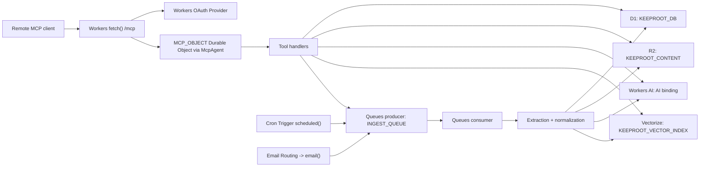

# KeepRoot MCP Server Technical Architecture

## Summary
The recommended implementation is a Cloudflare-native remote MCP server added to the existing `backend/` Worker project. The design keeps the current KeepRoot storage model and routes, then layers MCP transport, OAuth-friendly auth, asynchronous ingestion, hybrid search, source polling, email ingestion, and inbox management on top.

The architecture should stay inside one Cloudflare Worker application unless scale or organizational constraints later justify a split. That keeps deployment simple while still allowing specialized handlers for `fetch`, `queue`, `scheduled`, and `email`.

## Design Principles
- Reuse the current KeepRoot `bookmarks` storage and content pipeline wherever possible.
- Keep user-authenticated metadata in D1 and large blobs in R2.
- Make `save_item` and source sync idempotent by canonical URL plus user.
- Push long-running extraction and indexing work onto Queues.
- Use Cloudflare-native vector and embedding services instead of external search infrastructure.
- Keep the public MCP surface typed and small even if the internal pipeline has more moving parts.

## Recommended Runtime Topology



## Cloudflare Products To Use
| Product | Why it is needed | Concrete usage in this design |
| --- | --- | --- |
| Workers | Main compute runtime for MCP transport and KeepRoot API | Host `/mcp`, existing REST routes, source routes, and all tool handlers |
| Durable Objects | Stateful backing object for Cloudflare `McpAgent` remote transport | `MCP_OBJECT` class to serve the MCP server |
| Workers OAuth Provider | OAuth-friendly auth flow for remote MCP clients | Issue and validate MCP access tokens mapped to KeepRoot users |
| D1 | Primary relational storage | Users, items, tags, sources, inbox, plan settings, search docs, source runs |
| R2 | Durable blob storage | Markdown content JSON, raw HTML, email raw body, image assets |
| Queues | Async processing | URL extraction, feed sync fan-out, re-index jobs, backfills |
| Cron Triggers | Periodic work | Poll active RSS, YouTube, and X bridge sources |
| Workers AI | Embeddings generation | Create query and item embeddings for semantic search |
| Vectorize | Approximate nearest-neighbor vector search | Store per-item vectors and filter by `userId`, `status`, and `sourceId` |
| Email Routing plus Email Workers | Email source ingestion | Receive inbound mail aliases and enqueue item creation |
| Analytics Engine | Recommended for operational telemetry | Store recent tool usage, ingestion latency, and error counters for `get_stats` |
| Browser Rendering | Optional fallback | Render difficult JavaScript-heavy pages before readability extraction |
| Observability | Required for production operations | Logs, traces, and failure diagnosis |

## Recommended Wrangler Additions
The existing `backend/wrangler.jsonc` already binds D1 and R2. The MCP server design should add:

| Binding name | Product | Purpose |
| --- | --- | --- |
| `MCP_OBJECT` | Durable Object | Host the `McpAgent` server object |
| `KEEPROOT_VECTOR_INDEX` | Vectorize | Store item embeddings |
| `AI` | Workers AI | Create embeddings for items and queries |
| `INGEST_QUEUE` | Queues producer and consumer | Async save, sync, and re-index work |
| `USAGE_ANALYTICS` | Analytics Engine dataset | Recent usage and ingestion telemetry |
| `BROWSER` | Browser Rendering, optional | Rendered capture fallback for difficult pages |

The Worker should export:
- `fetch(request, env, ctx)`
- `scheduled(controller, env, ctx)`
- `queue(batch, env, ctx)`
- `email(message, env, ctx)`
- `class KeepRootMCP extends McpAgent`

## Suggested Code Layout
This is the recommended code organization, not a build instruction set.

```text
backend/
  src/
    index.ts
    mcp/
      server.ts
      auth.ts
      tools/
        save-item.ts
        search-items.ts
        list-items.ts
        get-item.ts
        update-item.ts
        whoami.ts
        list-sources.ts
        add-source.ts
        remove-source.ts
        get-stats.ts
        list-inbox.ts
        mark-done.ts
    ingest/
      queue.ts
      sync-source.ts
      save-url.ts
      extract-html.ts
      extract-pdf.ts
      email-source.ts
      canonicalize.ts
    search/
      hybrid.ts
      embeddings.ts
      fts.ts
    storage/
      items.ts
      sources.ts
      inbox.ts
      stats.ts
      account.ts
      search.ts
      existing-bookmarks-adapter.ts
```

## Open-Source Modules To Add
| Module | Why it belongs here |
| --- | --- |
| `agents` | Cloudflare `McpAgent` implementation for remote MCP on Workers |
| `@cloudflare/workers-oauth-provider` | OAuth provider flow for remote MCP clients |
| `@modelcontextprotocol/sdk` | Shared MCP types, inspector compatibility, and local parity utilities |
| `zod` | Tool input validation and schema definition |
| `linkedom` | DOM construction inside Workers for server-side readability parsing |
| `@mozilla/readability` | Main-article extraction from fetched HTML |
| `turndown` | HTML-to-Markdown conversion |
| `pdfjs-dist` | PDF text extraction for PDF saves |
| `fast-xml-parser` | RSS and Atom parsing in the Worker |
| `postal-mime` | MIME parsing for inbound email messages |

## Reuse From Current Repository
- Keep the internal storage term `bookmark`; expose `item` only at the MCP boundary.
- Reuse canonical URL normalization from the existing storage layer.
- Reuse the current R2 content layout for Markdown and HTML objects.
- Reuse existing tags and list relationships instead of creating a second tagging system.
- Reuse the current WebAuthn-backed user identity as the root identity for MCP auth.
- Keep the existing extension’s extraction stack as the reference behavior for readability and markdown output.

## Data Model Changes

### Existing Tables To Reuse
- `users`
- `sessions`
- `api_keys`
- `bookmarks`
- `bookmark_contents`
- `bookmark_images`
- `tags`
- `bookmark_tags`
- `lists`
- `smart_lists`

### New Columns On `bookmarks`
| Column | Type | Why |
| --- | --- | --- |
| `notes` | `TEXT` | User-authored notes for `update_item` and search |
| `source_id` | `TEXT NULL` | Link an item back to its originating source |
| `processing_state` | `TEXT NOT NULL DEFAULT 'ready'` | Track `queued`, `processing`, `ready`, `error` |
| `search_updated_at` | `TEXT NULL` | Track keyword index freshness |
| `embedding_updated_at` | `TEXT NULL` | Track vector freshness |

### New Tables

#### `account_settings`
Purpose: source of truth for `whoami`.

Suggested columns:
- `user_id TEXT PRIMARY KEY`
- `plan_code TEXT NOT NULL DEFAULT 'self_hosted'`
- `display_name TEXT`
- `limits_json TEXT NOT NULL DEFAULT '{}'`
- `features_json TEXT NOT NULL DEFAULT '{}'`
- `created_at TEXT NOT NULL`
- `updated_at TEXT NOT NULL`

#### `sources`
Purpose: configured subscriptions and source health.

Suggested columns:
- `id TEXT PRIMARY KEY`
- `user_id TEXT NOT NULL`
- `kind TEXT NOT NULL`
- `name TEXT NOT NULL`
- `normalized_identifier TEXT NOT NULL`
- `poll_url TEXT`
- `email_alias TEXT`
- `status TEXT NOT NULL DEFAULT 'active'`
- `config_json TEXT NOT NULL DEFAULT '{}'`
- `last_polled_at TEXT`
- `last_success_at TEXT`
- `last_error TEXT`
- `created_at TEXT NOT NULL`
- `updated_at TEXT NOT NULL`

Unique constraint:
- `(user_id, kind, normalized_identifier)`

#### `source_runs`
Purpose: sync observability and `get_stats`.

Suggested columns:
- `id TEXT PRIMARY KEY`
- `source_id TEXT NOT NULL`
- `run_type TEXT NOT NULL`
- `status TEXT NOT NULL`
- `discovered_count INTEGER NOT NULL DEFAULT 0`
- `saved_count INTEGER NOT NULL DEFAULT 0`
- `error_count INTEGER NOT NULL DEFAULT 0`
- `started_at TEXT NOT NULL`
- `finished_at TEXT`
- `error_text TEXT`

#### `inbox_entries`
Purpose: decouple inbox state from item status.

Suggested columns:
- `id TEXT PRIMARY KEY`
- `user_id TEXT NOT NULL`
- `bookmark_id TEXT NOT NULL`
- `source_id TEXT`
- `state TEXT NOT NULL DEFAULT 'pending'`
- `reason TEXT NOT NULL`
- `created_at TEXT NOT NULL`
- `processed_at TEXT`

Recommended enum values:
- `state`: `pending`, `done`, `dismissed`
- `reason`: `manual_save`, `source_sync`, `email_ingest`

#### `item_search_documents`
Purpose: keep searchable text in D1 without querying R2 at search time.

Suggested columns:
- `bookmark_id TEXT PRIMARY KEY`
- `user_id TEXT NOT NULL`
- `title TEXT`
- `notes TEXT`
- `tags_text TEXT`
- `excerpt TEXT`
- `body_text TEXT`
- `updated_at TEXT NOT NULL`

#### `item_search_fts`
Purpose: D1 FTS5 virtual table for keyword search.

Suggested indexed fields:
- `title`
- `notes`
- `tags_text`
- `excerpt`
- `body_text`

Suggested unindexed fields:
- `bookmark_id`
- `user_id`

#### `bookmark_embeddings`
Purpose: track vectorization state.

Suggested columns:
- `bookmark_id TEXT PRIMARY KEY`
- `user_id TEXT NOT NULL`
- `vector_id TEXT NOT NULL`
- `model_name TEXT NOT NULL`
- `embedding_version TEXT NOT NULL`
- `updated_at TEXT NOT NULL`

## R2 Object Layout
Retain the current object layout and extend it only where the new workflow needs raw source payloads.

| Key pattern | Purpose |
| --- | --- |
| `content/<hash>.json` | Canonical Markdown plus normalized text payload |
| `html/<hash>.html` | Raw or rendered HTML snapshot |
| `images/<hash>` | Saved image objects |
| `thumbs/<hash>/<variant>` | Thumbnail derivatives if retained |
| `email/<userId>/<messageId>.eml` | Optional raw inbound email archive for debugging |

## Authentication Architecture

### Recommended approach
- Keep the current KeepRoot user identity and WebAuthn sign-in for the dashboard.
- Add a Workers OAuth Provider flow for remote MCP clients.
- Map OAuth subject directly to `users.id`.
- Encode scopes at token issuance time and enforce them inside MCP tool handlers.

### Why not rely only on current API keys
- MCP clients increasingly expect remote OAuth-compatible flows.
- OAuth makes it easier to express scope, revocation, and approval semantics.
- API keys can remain as an operator-only compatibility mode, but should not be the primary public contract.

## Tool Implementation Matrix
| Tool | Primary code modules | D1 tables | Cloudflare bindings and products | Open-source modules |
| --- | --- | --- | --- | --- |
| `save_item` | `src/mcp/tools/save-item.ts`, `src/ingest/save-url.ts`, `src/ingest/extract-html.ts`, `src/ingest/extract-pdf.ts` | `bookmarks`, `bookmark_contents`, `bookmark_tags`, `tags`, `inbox_entries`, `item_search_documents`, `bookmark_embeddings` | Workers, D1, R2, Queues, Workers AI, Vectorize, optional Browser Rendering | `agents`, `@modelcontextprotocol/sdk`, `zod`, `linkedom`, `@mozilla/readability`, `turndown`, `pdfjs-dist` |
| `search_items` | `src/mcp/tools/search-items.ts`, `src/search/hybrid.ts`, `src/search/embeddings.ts`, `src/search/fts.ts` | `item_search_documents`, `item_search_fts`, `bookmarks`, `bookmark_embeddings` | Workers, D1, Workers AI, Vectorize | `agents`, `@modelcontextprotocol/sdk`, `zod` |
| `list_items` | `src/mcp/tools/list-items.ts`, `src/storage/items.ts` | `bookmarks`, `tags`, `bookmark_tags` | Workers, D1 | `agents`, `@modelcontextprotocol/sdk`, `zod` |
| `get_item` | `src/mcp/tools/get-item.ts`, `src/storage/items.ts` | `bookmarks`, `bookmark_contents`, `bookmark_images`, `tags`, `bookmark_tags` | Workers, D1, R2 | `agents`, `@modelcontextprotocol/sdk`, `zod` |
| `update_item` | `src/mcp/tools/update-item.ts`, `src/storage/items.ts`, `src/ingest/queue.ts` | `bookmarks`, `tags`, `bookmark_tags`, `item_search_documents`, `bookmark_embeddings` | Workers, D1, Queues, Workers AI, Vectorize | `agents`, `@modelcontextprotocol/sdk`, `zod` |
| `whoami` | `src/mcp/tools/whoami.ts`, `src/mcp/auth.ts`, `src/storage/account.ts` | `users`, `account_settings` | Workers, Workers OAuth Provider, D1 | `agents`, `@cloudflare/workers-oauth-provider`, `@modelcontextprotocol/sdk` |
| `list_sources` | `src/mcp/tools/list-sources.ts`, `src/storage/sources.ts` | `sources`, `source_runs` | Workers, D1 | `agents`, `@modelcontextprotocol/sdk`, `zod` |
| `add_source` | `src/mcp/tools/add-source.ts`, `src/ingest/sync-source.ts`, `src/storage/sources.ts` | `sources`, `source_runs` | Workers, D1, Queues, Cron Triggers, Email Routing and Email Workers | `agents`, `@modelcontextprotocol/sdk`, `zod`, `fast-xml-parser`, `postal-mime` |
| `remove_source` | `src/mcp/tools/remove-source.ts`, `src/storage/sources.ts` | `sources` | Workers, D1 | `agents`, `@modelcontextprotocol/sdk`, `zod` |
| `get_stats` | `src/mcp/tools/get-stats.ts`, `src/storage/stats.ts` | `bookmarks`, `inbox_entries`, `sources`, `source_runs`, `account_settings` | Workers, D1, recommended Analytics Engine | `agents`, `@modelcontextprotocol/sdk`, `zod` |
| `list_inbox` | `src/mcp/tools/list-inbox.ts`, `src/storage/inbox.ts` | `inbox_entries`, `bookmarks`, `sources` | Workers, D1 | `agents`, `@modelcontextprotocol/sdk`, `zod` |
| `mark_done` | `src/mcp/tools/mark-done.ts`, `src/storage/inbox.ts` | `inbox_entries` | Workers, D1 | `agents`, `@modelcontextprotocol/sdk`, `zod` |

## Request and Event Flows

### `save_item`
1. MCP tool validates input with `zod`.
2. Normalize canonical URL using the existing KeepRoot normalization logic.
3. Check D1 for an existing `bookmarks` row by `(user_id, url_hash)`.
4. Upsert a stub item with `processing_state = 'queued'` if content is not already current.
5. Write an ingest message to `INGEST_QUEUE`.
6. Queue consumer fetches the URL.
7. Branch extraction:
   - HTML: `linkedom` -> `Readability` -> `turndown`
   - PDF: `pdfjs-dist`
   - difficult pages: optional Browser Rendering fallback before readability
8. Persist content object to R2.
9. Update `bookmark_contents`, `item_search_documents`, and tag links in D1.
10. Generate embeddings with Workers AI.
11. Upsert vector into Vectorize and record metadata in `bookmark_embeddings`.
12. Create or refresh `inbox_entries` row.

### `search_items`
1. Build D1 filter clauses from MCP input.
2. Run D1 FTS query against `item_search_fts`.
3. Generate one query embedding with Workers AI.
4. Query Vectorize with the same user filter and optional metadata filters.
5. Merge keyword and vector candidates using reciprocal-rank fusion in Worker code.
6. Hydrate final item metadata from `bookmarks` and tag tables.

### `add_source`
1. Validate source type and normalize identifier.
2. Persist source row in D1.
3. If `kind = email`, provision or expose the inbound alias and stop there.
4. If `kind = rss`, `youtube`, or `x`, enqueue an initial sync job.
5. Scheduled polling later reuses the same queue-based sync path.

### `email` ingestion
1. Inbound message arrives through Email Routing.
2. `email()` handler stores raw MIME in R2 if debugging is enabled.
3. Parse MIME with `postal-mime`.
4. Extract source metadata and first trustworthy URL.
5. Enqueue `save_item`-style ingestion.

### `mark_done`
1. Validate inbox entry ownership.
2. Set `inbox_entries.state = 'done'` and `processed_at = now`.
3. Do not delete or rewrite the underlying item unless an explicit workflow later requires it.

## Search Architecture

### Keyword search
- Use a D1 FTS5 virtual table.
- Index title, notes, tags, excerpt, and a truncated plain-text body.
- Keep the FTS document small enough that D1 remains fast and inexpensive.

### Semantic search
- Store one embedding per item in v1.
- Build the embedding input from:
  - title
  - notes
  - tags
  - excerpt
  - first part of normalized body text
- Use Vectorize metadata to filter by `userId`, `status`, `sourceId`, and optionally `domain`.

### Ranking strategy
- Default search mode is hybrid.
- Run both keyword and vector retrieval.
- Fuse results in Worker code.
- Return a short `match_reason` field such as `keyword`, `semantic`, or `hybrid`.

### Re-index triggers
- After `save_item`
- After `update_item` when title, notes, or tags change
- After a source sync refreshes an item

## Source Connector Architecture

### RSS
- Poll the source URL on a Cron schedule.
- Parse XML with `fast-xml-parser`.
- Deduplicate entries by destination item URL plus user.

### YouTube
- Normalize channel or playlist input to a pollable feed URL when possible.
- Treat the feed as an RSS-like source after normalization.
- Save the destination watch URL as the item URL.

### X
- Do not scrape X directly in v1.
- Require an operator-configured bridge that exposes pollable feeds.
- Store the original user handle in `config_json` and the bridge URL in `poll_url`.

### Email
- Use inbound aliases such as `save+<user-token>@example.com`.
- Parse URL-first workflows before considering attachments.
- Keep email source ingestion event-driven instead of scheduled.

## Stats Architecture

### D1-backed stats
Use D1 for:
- total item count
- item count by status
- inbox pending count
- source count by kind
- last source sync timestamps

### Analytics Engine-backed stats
Use Analytics Engine for recent operational metrics:
- tool calls by name
- p50 and p95 tool latency
- queue failure counts
- source-sync error rates

`get_stats` should merge both when Analytics Engine is configured, and gracefully degrade to D1-only reporting when it is not.

## Operational Notes
- Every queue payload should include a `job_type` field, for example `save_url`, `sync_source`, or `reindex_item`.
- Use structured logs with `userId`, `jobType`, `itemId`, and `sourceId`.
- Record failed source runs in D1 so `list_sources` can expose health without querying logs.
- Keep the queue consumer idempotent; retries must not duplicate items.

## Recommended Decisions To Lock Before Coding
- Confirm whether v1 needs OAuth-only MCP access or OAuth plus API key compatibility.
- Decide whether `save_item` should ever block for extraction or always return a queued state.
- Decide whether `get_stats` must require Analytics Engine at launch or treat it as optional.
- Decide whether YouTube support is channel-only in v1 or channel plus playlist.
- Decide whether X support should ship at all in v1 or remain behind a hard feature flag.
